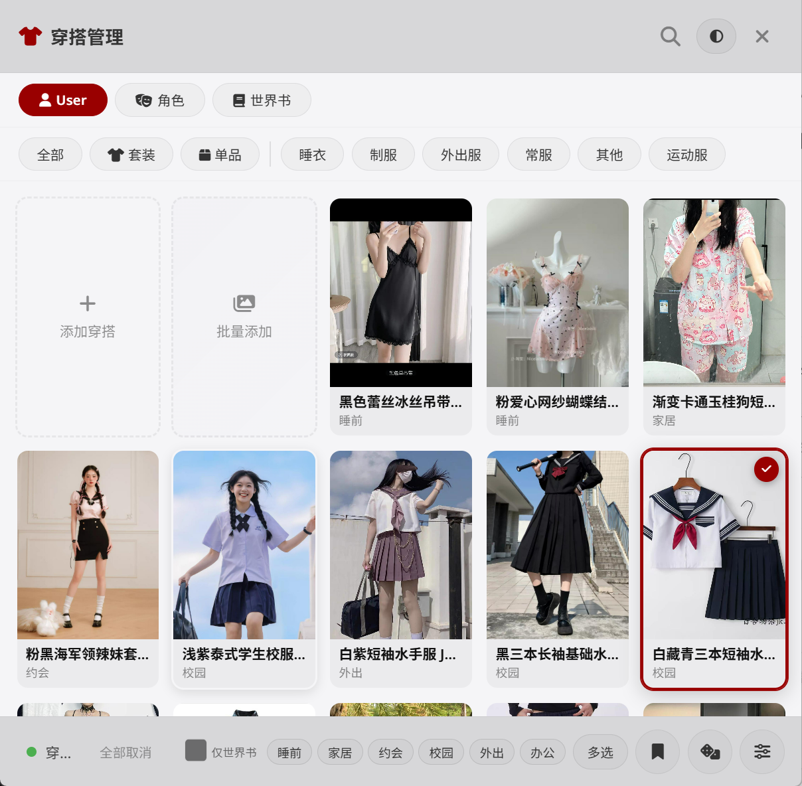

# 👗 Outfit Manager — 让你的 AI 角色真正「穿」上衣服

> 给 SillyTavern 酒馆的穿搭管理插件。从此 AI 不再乱编服装，每天穿什么你说了算。

---

## 🎯 一句话

把穿搭信息注入对话上下文，AI 描写服装时有据可依，人设不再崩。

---

## ✨ 功能一览

| 功能 | 说明 |
|------|------|
| 👗 **真实衣柜** | 上传穿搭照片 + 文字描述，分风格/季节/场景标签 |
| 🌐 **世界书联动** | 内置 33 种风格（现代 26 + 内衣 7），一键随机搭配 |
| 🤖 **AI 批量导入** | 照片发给 ChatGPT/Claude → 描述粘贴回来 → 自动建好 |
| 🎲 **场景快切** | 衣柜内部场景栏：外出 / 约会 / 通勤 / 家居 / 运动 / 睡前 |
| 🏷️ **自动标签** | 调用视觉 API 自动识别风格/季节/场景 |
| 📋 **批量粘贴** | 外部 AI 返回的描述一次性粘贴，按 `--- 第N套 ---` 自动分配 |
| 🔄 **启动提醒** | 每次开酒馆右下角弹 toast，告诉你今天穿什么 |
| 👤 **User/角色独立** | 你和每个角色各有独立衣柜，互不干扰 |

---

## 🎲 场景快速搭配

打开衣柜，分类栏下方有一排场景按钮。点击即可从启用的世界书中随机 roll 出一套搭配：

| 场景 | 匹配风格 | 数量 |
|------|---------|:----:|
| 外出 | 纯欲风、甜酷风、休闲风、韩系日常、学院风等 | 23 现代 + 4 内衣 |
| 约会 | 约会专属精致风格 | 23 现代 + 6 内衣 |
| 通勤 | 通勤休闲风、韩系日常风、轻熟职场风 | 3 现代 |
| 家居 | 睡衣（居家舒适） | 1 现代 |
| 运动 | 运动风(街头潮牌版)、基础纯棉 | 1 现代 + 1 内衣 |
| 睡前 | 睡衣（不混内衣） | 1 现代 |

### 风格与场景映射表

**现代穿搭（uu现代世界书 26 种风格）**

| 风格 | 外出 | 约会 | 办公 | 家居 | 运动 | 睡前 |
|------|:----:|:----:|:----:|:----:|:----:|:----:|
| 纯欲风 | ✅ | ✅ | | | | |
| 甜酷风 | ✅ | ✅ | | | | |
| 休闲风 | ✅ | | | | | |
| 千禧y2k风 | ✅ | ✅ | | | | |
| 运动风(街头潮牌版) | | | | | ✅ | |
| 日系软甜风 | ✅ | ✅ | | | | |
| 日系复古风 | ✅ | ✅ | | | | |
| 日系保暖 | ✅ | ✅ | | | | |
| 办公室海妖风 | ✅ | ✅ | | | | |
| 通勤休闲风 | ✅ | | ✅ | | | |
| 学院风 | ✅ | | | | | |
| 韩系日常风 | ✅ | ✅ | ✅ | | | |
| 韩系女团风 | ✅ | ✅ | | | | |
| 现代哥特风 | ✅ | ✅ | | | | |
| 旗袍 | ✅ | ✅ | | | | |
| 新中式 | ✅ | ✅ | | | | |
| 御姐辣妹风 | ✅ | ✅ | | | | |
| 财阀千金风 | ✅ | ✅ | | | | |
| 小香风 | ✅ | ✅ | | | | |
| 轻熟职场风 | ✅ | ✅ | ✅ | | | |
| 多巴胺风 | ✅ | ✅ | | | | |
| 欧美风 | ✅ | ✅ | | | | |
| bm风 | ✅ | ✅ | | | | |
| 轻亚风 | ✅ | ✅ | | | | |
| 睡衣 | | | | ✅ | | ✅ |
| 洛丽塔 / Cos装 / 高定礼服 | 无固定映射，走内容关键词匹配 | | | | | |

**内衣穿搭（uu内衣世界书 7 种风格）**

| 风格 | 外出 | 约会 | 办公 | 家居 | 运动 | 睡前 |
|------|:----:|:----:|:----:|:----:|:----:|:----:|
| 基础纯棉 | ✅ | | | | ✅ | |
| 蕾丝性感 | | ✅ | | | | |
| 法式三角杯 | | ✅ | | | | |
| 聚拢调整 | ✅ | ✅ | | | | |
| 少女可爱 | ✅ | ✅ | | | | |
| 丝绸奢华 | | ✅ | | | | |
| 抹胸式 | ✅ | ✅ | | | | |

> 家居和睡前场景**不会搭配内衣**，只产出睡衣穿搭。

---

## 📦 安装

```
酒馆 → 扩展管理 → 安装插件 → 输入 URL：
https://github.com/gabby1111111111/Outfit-Manager
```

点安装 → 重启 → 扩展管理启用 → 完成。

---

## 🚀 快速上手

**有照片：** 点「批量添加」→ 选图片 → 点「复制提示词」丢给 ChatGPT/Claude → 描述粘贴回来 → 创建

**没照片：** 勾「仅世界书」→ 底部按钮随机穿 → 弹窗确认

**混着来：** 平时底部按钮随机穿 → 想穿自己某套时去衣柜点一下就行

---

## ⚙️ 设置建议

- **注入位置**：用户消息末尾（兼容性最好）
- **注入方式**：纯文字（最稳定）
- **API**：默认使用酒馆主 API，也可另配辅助 API

---

## 🤖 兼容

| 模型 | 状态 |
|------|------|
| Gemini 2.5 Pro | ✅ |
| Claude 3.5/4 | ✅ |
| DeepSeek V3/R1 | ✅ |

---

## 🙏 鸣谢

- 💎uu现代v2.1 / 🦋uu内衣v1.0 世界书 — 来自 Discord 旅程社区的 **离谱喵✧˖°** 老师
- 二改自 [wenshui012/Outfit-Manager](https://github.com/wenshui012/Outfit-Manager)

---

## 📸 截图




